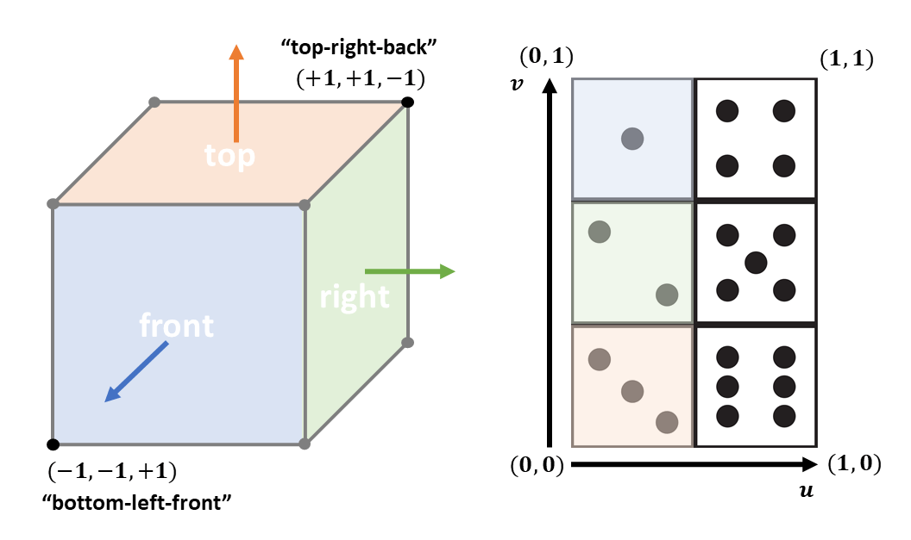

# SFU CMPT 361 Assignment 4: Rasterizing Lines and Triangles!

In this assignment, you will implement shading, texturing and transformations for triangle meshes!

# Getting started
To run and develop this assignment you must start a local HTTP server in the directory containing `a4.html`.
The simplest way is using python.
In MacOS and Linux `python3 -m http.server` in a terminal should work out of the box.
For Windows or in case of any trouble, see these instructions: [https://developer.mozilla.org/en-US/docs/Learn/Common_questions/set_up_a_local_testing_server#running_a_simple_local_http_server](https://developer.mozilla.org/en-US/docs/Learn/Common_questions/set_up_a_local_testing_server#running_a_simple_local_http_server).
You may also use an IDE that can run a simple HTTP server for your workspace (e.g., the "Go Live" mode in VS Code, or similar functionality with IntelliJ).
Once the HTTP server is up, navigate your browser to [http://localhost:8000/a4.html](http://localhost:8000/a4.html).

# Implementation instructions

Like the previous assignment, we use text input to specify what to render.
We use the following syntax:
- `p,id,cube;` creates a unit cube mesh and gives it the name `id`
- `p,id,sphere,i,j`	creates a unit sphere mesh with name `id`, formed using `i` "stacks", and `j` "sectors"
- `m,id,ka,kd,ks,shininess,texture;` creates a Phong shader material named by `id`, with ambient (`ka`), diffuse (`kd`), specular (`ks`), and specular exponent (`shininess`) coefficients, and an optional texture image specified by `texture`.
- `X,id,T,x,y,z;` specifies a transformation that translates object `id` by `(x,y,z)`.
- `X,id,R?,theta;` specifies a rotation of object `id` around axis `?` (i.e. `Rx` rotates around `x` etc.), by counter-clockwise angle in degrees `theta`.
- `X,id,S,x,y,z;` specifies a scale transformation of object `id` by scale factors `(x,y,z)` along each axis.
- `o,id,prim,mat;` adds an object to the scene with name `id`. The object uses the primitive mesh with id matching `prim` and the Phong shader material with id matching `mat`. Note this is the way to actually add an object into the scene (i.e. primitives and materials are not part of the scene until they are used by an object).
- `l,id,type,x,y,z,ir,ig,ib;` sets the light (with name `id`) and light type `type` at position `(x,y,z)` with intensity `(ir,ig,ib)`. We only support a single light of type `point`.
- `c,id,type,ex,ey,ez,lx,ly,lz,ux,uy,uz;` sets the camera to be placed at position `(ex,ey,ez)` and looking towards `(lx,ly,lz)` with up axis `(ux,uy,uz)`. We only support a single camera of type `perspective`.

You can change the contents of the text box to define new primitives, materials, and objects that use them, as well as to change the light and camera parameters.
Clicking the "Update" button will refresh the image output.
The starter code will produce some a rectangle and triangle close to the origin both shaded with a "debug" temporary color.
Your job is to implement the logic that will create cube and sphere triangle meshes, transform them according to the specified transforms, and finally shade and texture them!

Note that the default input defines quite a bit more information, including materials, and transformations for several cube objects and a sphere object.
You will likely want to user simpler inputs at the beginning as you get started (e.g., just one unit cube when implementing cube triangle mesh generation).
Later, as you get more functionality implemented, you can start to use more features.

It is a good idea to use simple test case inputs to verify that your implementation is correct in a step-by-step fashion.
The guidelines below offer a suggested strategy for implementing all required functionality, and it is wise to select test case inputs to verify each part is correct before moving on to other parts.

Here is a suggested guide for how to approach this assignment:

## Triangle Mesh Generation (3 pt)

First, implement the unit cube and unit sphere triangle mesh creation logic in `createCube` and `createSphere` respectively.
To do this you will populate the `positions`, `normals`, `uvCoords`, and `indices` members of the `TriangleMesh` within each of these two functions (creating an indexed triangle mesh, i.e. "vertex list" + "index list" representation).
The unit cube should have bottom-left-front corner `-1,-1,+1` and top-right-back corner `+1,+1,-1`.
For the cube, you can use a "triangle soup" encoding (i.e. repeat vertices that are shared at corners of the cube, and leave the `indices` unpopulated).
The surface normals at each vertex of the cube should point in the direction of the cube's face surface normal (note that you will need to repeat vertex positions to define distinct normals for each face at a "corner").
The unit sphere should be centered at the origin and have radius equal to `1`.
You should use the "stacks and sectors" approach to create a triangle mesh sphere using spherical coordinates.
This time, you will likely want to encode vertex indices into `indices` as that is easier than trying to create an unindexed "triangle soup" for the sphere.
You may find the following description of the stacks and sectors algorithm at [http://www.songho.ca/opengl/gl_sphere.html](http://www.songho.ca/opengl/gl_sphere.html) algorithm to be useful.
For the sphere, the surface normals at vertices should point outwards from the center of the sphere.
You may find lectures G8 and G9, and the associated textbook chapters to be helpful.
Make sure to compute texture coordinates (UV coordinates) as well for both the unit cube and unit sphere.
These will be important for shading and texturing later on.

## Transformations (2 pt)

Now, implement transformations to position your triangle meshes.
In function `computeTransformation` you will receive a sequence of transformations defined in the input text for a specific object, and you will need to compute the overall 4x4 transformation matrix.
Note that the `transformSequence` parameter to the function contains an array of transformation definitions (using the syntax defined above), in the order in which they should be applied to the object.
Also note that rotations are defined in degrees in the input text, but you will likely want to convert to radians to compute the transformation matrices.
Lecture G10 as well as the referenced textbook chapters should be helpful.

## Shading (3 pt)

Next, let's start to implement shading.
You will need to add shading logic into the `VERTEX_SHADER` and `FRAGMENT_SHADER` GLSL code.
This overview of WebGL and GLSL shaders may be useful: [https://webglfundamentals.org/webgl/lessons/webgl-shaders-and-glsl.html](https://webglfundamentals.org/webgl/lessons/webgl-shaders-and-glsl.html).
First, implement the ambient and Lambertian components of the Blinn-Phong reflection model (using the `ka` and `kd` coefficients).
Then, implement and add the specular component (using the `ks` and `shininess` coefficients).
You will likely want to define and use direction vectors corresponding to the surface normal, the camera view direction, and the light direction.
A useful debugging strategy when working with shaders is to set the fragment color according to some value that you want to check (e.g., mapping a dimension of the normal vector to a color channel, or a dot product to another color channel).
You may find lecture G7 and textbook chapters 6.2-6.5 to be helpful.

## Texturing (2 pt)

Finally, implement texturing by using the interpolated texture coordinates (`vTexCoord`) and the texture sampler (`uTexture`) in the fragment shader.
If the material specifies a texture, modulate the color from Blinn-Phong shading by the texture color (i.e. multiply the shaded color and the texture color).
The uniform boolean variable `hasTexture` specifies whether the material has a texture.
Note that we provide two texture image files: `dice.jpg` and `globe.jpg`.
A correctly textured sphere primitive will display a globe that is upright and shows North America when parsing the default input handed out with the assignment (see output image below).
A correctly textured cube primitive will display the six faces of a [right-handed die](https://en.wikipedia.org/wiki/Dice#Arrangement), with the "one dot" face being the front face of the cube, i.e. having bottom left coordinates -1,-1,1 and top right coordinates 1,1,1.
If you "unwrap" the faces they should look like ⚅⚄⚀⚁, with ⚂ above ⚅, and ⚃ below ⚅.
It is a good idea to use pen and paper and draw out the UV coordinate grid for the die image.
Think about how to define the corners of each face, and therefore what the UV coordinates at each vertex should be.
See the following illustration which indicates a couple of vertex positions and the mapping of cube faces to the texture image: 
You may find lecture G11 and textbook chapters 7.3-7.5 to be helpful.

## Bonus (1 pt)

Do something creative!
Now that you can shade, transform, and texture meshes, have fun with creating an interesting and visually appealing image.
Make sure to save the input text that produces this creative artifact into the `DEF_INPUT` variable.

## Additional points on implementation details

- You should only add code to `a4.js`. No other file should be changed, and you should also not change the import and export statements at the top and bottom of `a4.js`.
- Be careful about transformations of vertex positions and normals in the shaders, and keep in mind in what coordinate frame you want your points and vectors to be in for a particular computation. The matrices `projectionMatrix`, `viewMatrix`, and `modelMatrix` contain the camera projection, camera viewing transform, and overall object 4x4 transformation matrices respectively. The matrix `normalMatrix` contains the 3x3 matrix (upper 3x3 component of the inverse-transpose of the object transformation) which you can use to transform normals.
- You may find the `Mat4` class defined in `math.js` useful.  You are free to use it, or to implement your own 4x4 matrix helper functions.  The `computeTransformation` function is required to return a single 4x4 `Mat4` which is equivalent to a 16-element `Float32Array` stored in column-major order (e.g., the last four elements are the last column).
- You are not allowed to use any external libraries, or to copy code from anywhere without appropriate attribution. The assignment should only require simple math operations that you can achieve using JavaScript and a handful of functions from the built-in `Math` library.

## Checking and submitting your implementation

The default input should produce an image like the below when you have correctly implemented all parts of the assignment:

You are free to discuss this assignment online on the CourSys discussion forum, or elsewere but you need to implement this assignment individually and by yourself.  We will not tolerate any breach of academic integrity (copying code from other students or elsewhere, providing code to other students).

Submit only your completed `a4.js` file to CourSys.
Your implementation must function correctly with all other files as provided in the starter code.

## FAQ

**Can I use any external libraries/resources for my implementation?**
No. However, note that we provide a `Mat4` class representing a 4x4 matrix that may be useful for implementing transformations. This class stores matrix elements in column-major order. That is, the topmost element of the last column of the matrix is at index `12`.

**I can't see the sphere and/or cube mesh**
Check that you are not rendering two objects on top of each other. General tip: when focusing on implementation of a specific part such as the cube mesh or sphere mesh construction, it will help to simplify your scene.  Feel free to comment out other objects in the scene, comment out transformations, and set your camera position to somewhere convenient to check a particular part of the mesh you are constructing.

**Order of transformations, and composing transformations**
Transformations should be applied to each object in the order they are specified in the input text.  This is the order in which you will get transformations in the `transformSequence` array.  Concretely: the 0-th transform in the `transformSequence` array should be applied first, then the 1-st transform, and so forth until the last transform.

General point to keep in mind: the order matters when composing transformations.  Sequences of translations and rotations will have different effect depending on the order in which they are applied.  If you want to produce "object frame" rotations or scales, it is a good idea to apply such transformations before any translation away from the origin.  Note: the default input text given with the starter code should produce exactly the sample output image without any changes / additions / re-ordering of transformations in the default input text.

Refer to the part of lecture G10 on "Composing Transformations" for more details.  The situation is illustrated by the diagram there showing a sequence of transformations of a rectangle.  You can think of all the transformations as happening in the "world frame".

**What shading model to implement?**
Implement the Blinn-Phong shading model (also known as "modified Phong").  This uses the "half-way vector" H which is easier to compute than the reflection vector R in the original Phong model.

**What are the values for La, Ld, Ls?**
You should assume that all light intensities (ambient, diffuse, specular) are equal to the `lightIntensity` variable. In other words, assume `La = Ld = Ls = lightIntensity`.

**How can I get the L, N, V etc. vectors in my shader and use them for shading?**
Hint: look at the `attribute` and `uniform` variables available to you in the vertex and fragment shader code. These provide the vertex position (`position`), vertex normal (`normal`), and light position (`lightPosition`).  Note that you may want to pass some variables from the vertex shader to the fragment shader.  To do this, you need to define a `varying` variable in both the vertex and fragment shaders, set the value in the vertex shader, and retrieve the interpolated value in the fragment shader.  The `varying vec3 temp` given in the starter code is an example of how to do this.  Refer to the example shaders in lecture G15, and the A4 tutorial for more details.

For the camera position: think about where the camera is in the camera coordinate frame.  In the vertex shader you have access to three transformation matrices: model transformation (`modelMatrix`), view transformation (`viewMatrix`), and projection transformation (`projectionMatrix`).  You will likely want to use some of these to transform some points into the camera coordinate frame so you can compute some of the vectors you need for shading.  Refer to the part of lecture G15 on "setting up model-view-projection" matrices for more details on the three matrices.

**My sphere texture looks "off" from the sample output**
Hint: the starting angles and direction in which you construct triangles for the sphere mesh will both influence texture mapping (since they influence the UV values you assign for each vertex).  Note that you do have a choice of what angle ranges you use, and in what direction the angle range iterates as you construct the sphere triangle-by-triangle.  You need not use the default ranges given in the "stacks and sectors" example.  In other words: you are free to make changes to the angle ranges in your `createSphere` function.

Note that the default input should exactly produce the sample output image.  So you should not change the default input text with additional or different transformations to match the output image texture orientation.
